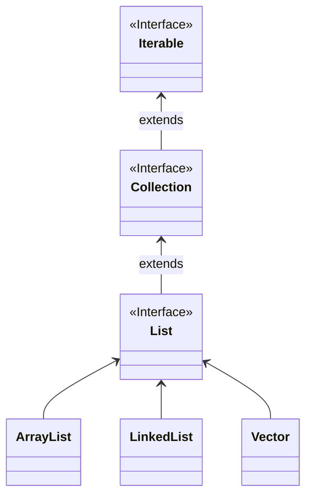

# List

java.util.List

## 最简单的类图

```mermaid
classDiagram
		class Iterable {
			<<Interface>>
		}
		class Collection {
			<<Interface>>
		}
		class List{
			<<Interface>>
		}
		class ArrayList
		class LinkedList
		
    Iterable <-- Collection : extends
    Collection <-- List : extends
    List <-- ArrayList
    List <-- LinkedList
    List <-- Vector
```
