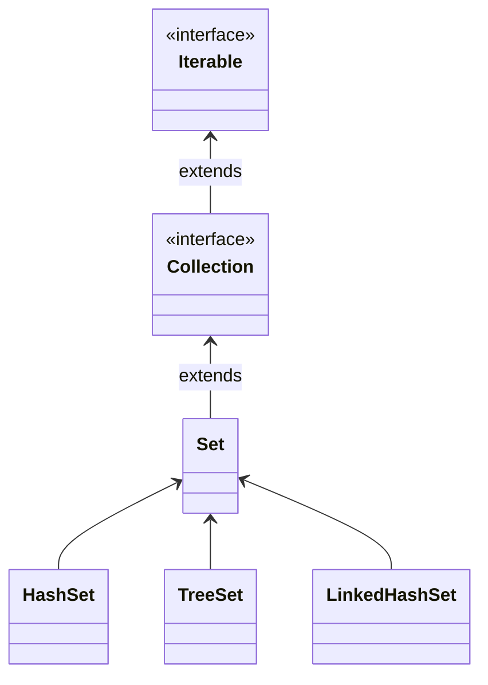

# Set

java.util.Set

```mermaid
classDiagram
	class Iterable{
		<<interface>>
	}
	class Collection{
		<<interface>>
	}
	class Set
	
	Iterable <-- Collection : extends
	Collection <-- Set : extends
	Set <-- HashSet
	Set <-- TreeSet
	Set <-- LinkedHashSet
```

