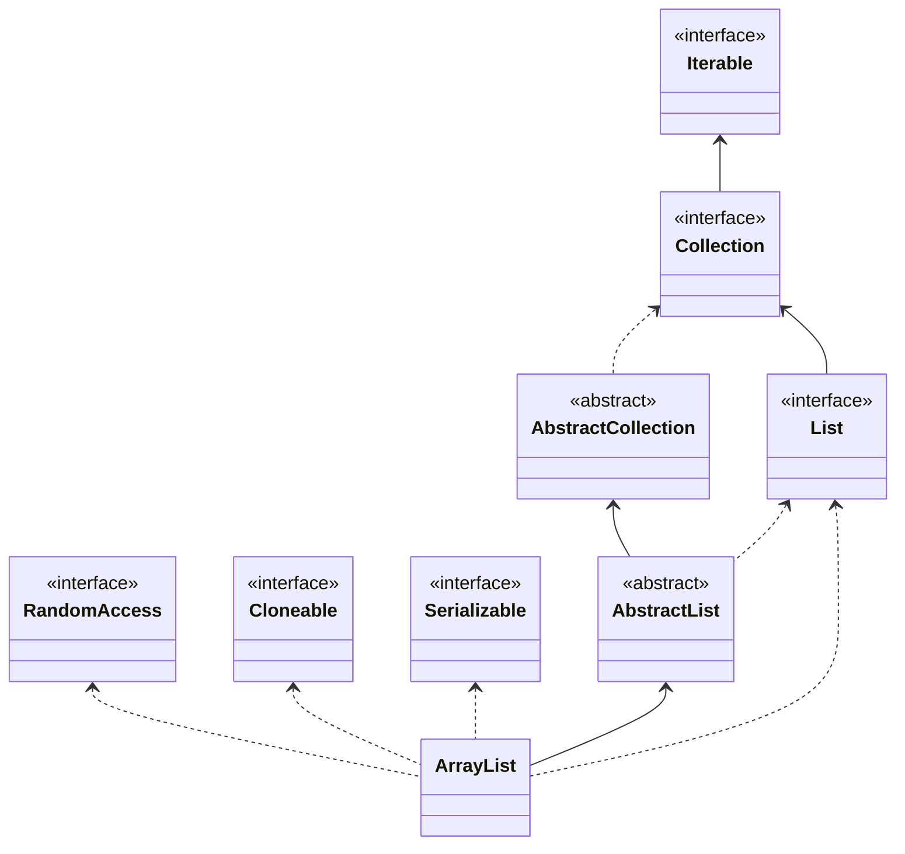

# ArrayList源码解读

> [源码](http://coderead.pandacode.cn:82/xref/java-8/java/util/ArrayList.java)

## 类图



## 常量

```java
// 默认初始容量，初始化未指定容量时，第一次add()会默认扩容为DEFAULT_CAPACITY。
private static final int DEFAULT_CAPACITY = 10;
// 用于空实例的共享空数组实例。
private static final Object[] EMPTY_ELEMENTDATA = {};
// 用于默认大小的空实例的共享空数组实例。我们将其与 EMPTY_ELEMENTDATA 区分开来，以了解在添加第一个元素时要膨胀多少。
private static final Object[] DEFAULTCAPACITY_EMPTY_ELEMENTDATA = {};
// ArrayList数据存储。
transient Object[] elementData;
// ArrayList 的大小（它包含的元素数）。
private int size;
// 数据调整次数
protected transient int modCount = 0;
```

## 初始化

```java
// 指定初始容量
public ArrayList(int initialCapacity);
// 初始化elementData赋值空值，this.elementData = DEFAULTCAPACITY_EMPTY_ELEMENTDATA。
public ArrayList();
// 将Collection值用于初始化。
public ArrayList(Collection<? extends E> c);
```

## add

```java
public boolean add(E e) {
  // 确保内部容量，容量满之后进行扩容，扩容公式：oldCapacity + (oldCapacity >> 1)
  ensureCapacityInternal(size + 1);  // Increments modCount!!
  // 赋值，此时已扩容结束，可直接进行赋值。
  elementData[size++] = e;
  return true;
}
// 确保内部容量
private void ensureCapacityInternal(int minCapacity) {
  ensureExplicitCapacity(calculateCapacity(elementData, minCapacity));
}
// 确保显式容量
private void ensureExplicitCapacity(int minCapacity) {
  // 数据调整次数+1
  modCount++;

  // 溢出意识代码
  if (minCapacity - elementData.length > 0)
    grow(minCapacity);
}
// 计算容量
private static int calculateCapacity(Object[] elementData, int minCapacity) {
  // 验证是否第一次扩容，第一次扩容，直接扩容为DEFAULT_CAPACITY=10。
  if (elementData == DEFAULTCAPACITY_EMPTY_ELEMENTDATA) {
    return Math.max(DEFAULT_CAPACITY, minCapacity);
  }
  return minCapacity;
}
// 扩容
private void grow(int minCapacity) {
  // 溢出意识代码
  int oldCapacity = elementData.length;
  int newCapacity = oldCapacity + (oldCapacity >> 1); // 扩容公式
  if (newCapacity - minCapacity < 0)
    newCapacity = minCapacity;
  if (newCapacity - MAX_ARRAY_SIZE > 0)
    newCapacity = hugeCapacity(minCapacity);
  // minCapacity is usually close to size, so this is a win:
  elementData = Arrays.copyOf(elementData, newCapacity); // 根据newCapacity大小进行扩容。
}
```

### 扩容 Arrays.copyOf

```java
public static <T> T[] copyOf(T[] original, int newLength) {
  return (T[]) copyOf(original, newLength, original.getClass());
}
public static <T,U> T[] copyOf(U[] original, int newLength, Class<? extends T[]> newType) {
  @SuppressWarnings("unchecked")
  // 根据newLength大小，进行扩容，创建一空数组。
  // 可以看到每次扩容都是一次创建对象。
  T[] copy = ((Object)newType == (Object)Object[].class)
    ? (T[]) new Object[newLength]
    : (T[]) Array.newInstance(newType.getComponentType(), newLength);
  // 将原有数据copy到扩容后的数组中。
  System.arraycopy(original, 0, copy, 0,
                   Math.min(original.length, newLength));
  return copy;
}
```

