## 👀 快捷通道
**常用在线工具：**
::: cardList 4
```yaml
- name: JSON格式化
  desc: ""
  link: https://www.bejson.com/jsonviewernew/
  bgColor: '#DFEEE7'
  textColor: '#2A3344'
- name: 时间戳转换
  desc: ""
  link: http://tool.chinaz.com/tools/unixtime.aspx
  bgColor: '#DFEEE7'
  textColor: '#2A3344'
- name: codepen
  desc: ""
  link: https://codepen.io/
  bgColor: '#DFEEE7'
  textColor: '#2A3344'
- name: BootCDN
  desc: ""
  link: https://www.bootcdn.cn
  bgColor: '#DFEEE7'
  textColor: '#2A3344'
```
:::
**Web API：**
::: cardList 4
```yaml
- name: MDN
  desc: ""
  link: https://developer.mozilla.org/zh-CN/
  bgColor: '#DFEEE7'
  textColor: '#2A3344'
- name: React
  desc: ""
  link: https://zh-hans.reactjs.org
  bgColor: '#DFEEE7'
  textColor: '#2A3344'
- name: JDK1.8
  desc: ""
  link: https://docs.oracle.com/javase/8/docs/api/?xd_co_f=47c934d9-e663-4eba-819c-b726fc2d0847
  bgColor: '#DFEEE7'
  textColor: '#2A3344'
- name: MongoDB
  desc: ""
  link: https://docs.mongodb.com/manual/
  bgColor: '#DFEEE7'
  textColor: '#2A3344'
- name: Vuepress
  desc: ""
  link: https://vuepress.vuejs.org/zh/
  bgColor: '#DFEEE7'
  textColor: '#2A3344'
- name: Vdoing
  desc: ""
  link: https://doc.xugaoyi.com/
  bgColor: '#DFEEE7'
  textColor: '#2A3344'
```
:::
**运维管理平台：**

::: cardList 4
```yaml
- name: dnspod域名控制台
  desc: ""
  link: https://console.dnspod.cn
  bgColor: '#DFEEE7'
  textColor: '#2A3344'
- name: 腾讯云控制台
  desc: ""
  link: https://console.cloud.tencent.com/
  bgColor: '#DFEEE7'
  textColor: '#2A3344'
- name: 阿里云控制台
  desc: ""
  link: https://homenew.console.aliyun.com/
  bgColor: '#DFEEE7'
  textColor: '#2A3344'
- name: 微信公众号控制台
  desc: ""
  link: https://mp.weixin.qq.com/
  bgColor: '#DFEEE7'
  textColor: '#2A3344'
- name: 百度站长平台
  desc: ""
  link: https://ziyuan.baidu.com/
  bgColor: '#DFEEE7'
  textColor: '#2A3344'
```
:::

## 🌲 平台介绍

本平台是一个对语言、组件、服务进行总结记录的指导手册，所有文章都会以介绍、使用、常见问题等维度进行总结记录，并且会不间断的优化更新文章内容，以达到可以满足大部分需求。

## 🌹 个人服务链接

- [熊猫代码文档记录平台（当前平台）](https://pandacode.cn/)
- ~~[源码在线浏览平台（正在不断引入源码）](http://coderead.pandacode.cn:82/)~~
- ~~[文件下载平台（尚未完善）](http://file.download.pandacode.cn:81/)~~
- ~~[文件在线管理平台（尚未完善）](http://file2.pandacode.cn:81/)~~
- [微信公众号 Markdown 编辑器](https://wechat.pandacode.cn/)

## 📮 联系

- 微信：gsf-java
- Email：13301203454@163.com
- Github：[https://github.com/guoshunfa](https://github.com/guoshunfa)
- Gitee：[https://gitee.com/guoshunfa](https://gitee.com/guoshunfa)

## 📖 大纲

```mermaid
graph TB
熊猫code知识库-->Java
熊猫code知识库-->Spring
熊猫code知识库-->算法
熊猫code知识库-->数据库
熊猫code知识库-->部署
熊猫code知识库-->前端
熊猫code知识库-->测试
熊猫code知识库-->Python

Java-->Java基础
Java-->Java集合框架
Java-->Java多线程与并发
Java-->JavaIO:NIO:AIO
Java-->Java各版本特征
Java-->JVM相关

Spring-->Spring_
Spring-->SpringBoot
Spring-->SpringCloud

算法-->常见排序算法

数据库-->SQL数据库
数据库-->NOSQL数据库
数据库-->数据库通用理论

SQL数据库-->Mysql
SQL数据库-->Oracle
SQL数据库-->SqlServer
NOSQL数据库-->MongoDB
NOSQL数据库-->Elasticsearch
NOSQL数据库-->Redis

部署-->服务器
部署-->Docker
部署-->服务
部署-->版本控制
部署-->脚本

前端-->前端基础
前端-->前端框架
前端-->组件库

前端基础-->JS
前端框架-->Vue
前端框架-->VuePress
前端框架-->Electron

测试-->测试基础
测试-->测试框架

Python-->Python基础
Python-->Python制作脚本
Python-->Python成熟工具包


















 
click Java "/pages/380156/"
```


