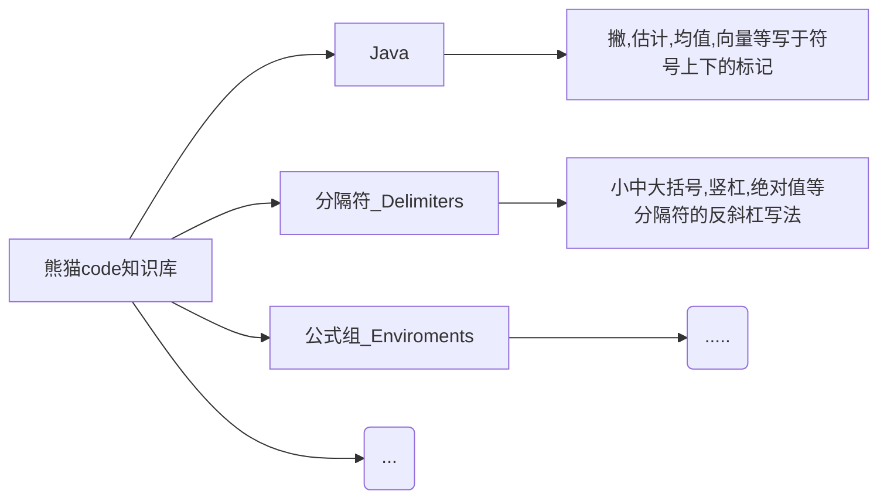

## 👀 快捷通道

[Github](https://github.com/) | [掘金](https://juejin.im/) | [简书](https://www.jianshu.com/) | [思否](https://segmentfault.com/) | [鱼塘热榜](https://mo.fish/main/home/hot) | [力扣](https://leetcode-cn.com/)

[JSON格式化](https://www.bejson.com/jsonviewernew/) | [时间戳转换](http://tool.chinaz.com/tools/unixtime.aspx) | [正则可视化](https://regex101.com/) | [反编译 Jar](http://www.decompiler.com) | [反编译 Class](http://javare.cn/De)

[jdk1.8](https://docs.oracle.com/javase/8/docs/api/?xd_co_f=47c934d9-e663-4eba-819c-b726fc2d0847) | [MongoDB](https://docs.mongodb.com/manual/) | [hutool](https://hutool.cn/) | [vuepress-theme-vdoing](https://doc.xugaoyi.com/) | [vuepress](https://vuepress.vuejs.org/zh/)

[dnspod域名控制台](https://console.dnspod.cn) | [腾讯云控制台](https://console.cloud.tencent.com/) | [阿里云控制台](https://homenew.console.aliyun.com/) | [微信公众号控制台](https://mp.weixin.qq.com/) | [百度站长平台](https://ziyuan.baidu.com/)

## 🌲 平台介绍

为开发者提供的万能知识库。

## 🌹 个人服务链接

- [熊猫代码文档记录平台（当前平台）](https://pandacode.cn/)
- [源码在线浏览平台（正在不断引入源码）](http://coderead.pandacode.cn:82/)
- [文件下载平台（尚未完善）](http://file.download.pandacode.cn:81/)
- [文件在线管理平台（尚未完善）](http://file2.pandacode.cn:81/)
- [微信公众号 Markdown 编辑器](https://wechat.pandacode.cn/)

## 📮 联系

- 微信：gsf-java
- Email：13301203454@163.com
- Github：[https://github.com/guoshunfa](https://github.com/guoshunfa)
- Gitee：[https://gitee.com/guoshunfa](https://gitee.com/guoshunfa)

## 📖 大纲

