# 健身-背部练习

## 背

- https://zhuanlan.zhihu.com/p/33650857

### 竖脊肌

https://zhuanlan.zhihu.com/p/444112164

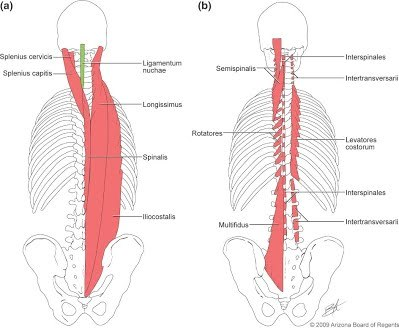

#### 训练方法 - 俯卧两头起

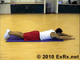

#### 训练方法 - 山羊挺身

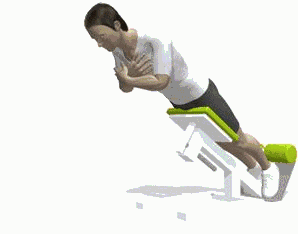

#### 训练方法 - **硬拉**

#### 训练方法 - **负重躬身**

#### 训练方法 - **游式挺身**

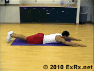

### 斜方肌

https://zhuanlan.zhihu.com/p/86940350

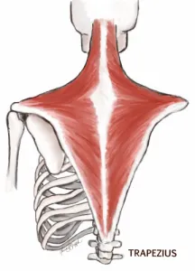

#### 训练方法 - 上束

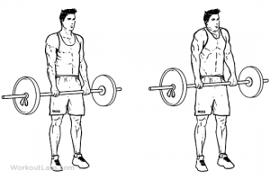

### 菱形肌

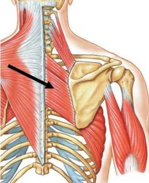

#### 训练方法 - 俯身哑铃飞鸟

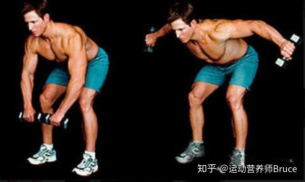

### 背阔肌

https://www.163.com/dy/article/GMTJE1G10533MTND.html

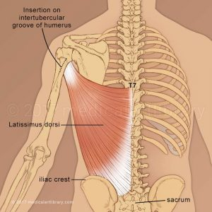

#### 训练方法 - 杠铃划船

- 双脚打开与肩同宽站立，持铃在身前，稍稍低于膝盖，双臂伸直，肘关节不要锁死
- 微微屈膝，从臀部屈背，保持身体成45度角不变，收紧肩胛骨，绷紧整个上身，将杠铃上提至腹部
- 稍停后缓缓下铃回复到起始位置

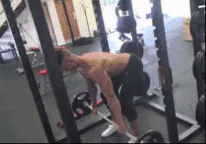

#### 训练方法 - 俯身哑铃划船

- 上身前倾，臀部向后，弯腰并确保背部挺直，使上身几乎和地面平行
- 一只手臂支撑身体，另一只手持哑铃，膝盖略微弯曲
- 肩胛收缩，肘部贴紧身体，将哑铃快速上提至身体侧方
- 顶点稍停后慢慢下放还原

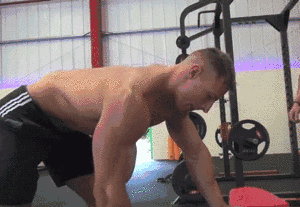

### 大圆肌

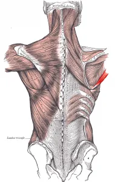

### 三角肌后束

